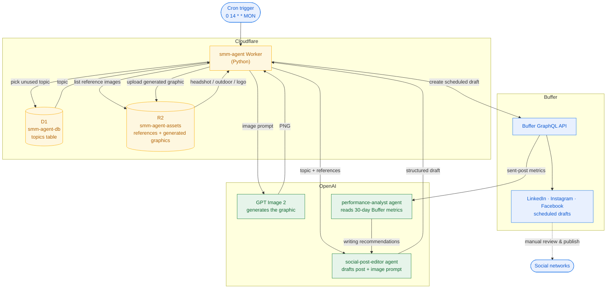

# smm-agent

`smm-agent` is an automated social media marketing agent for real estate. It
runs on Cloudflare Workers and publishes three fresh, on-brand posts to every
connected social channel every week — no manual writing, image sourcing, or
scheduling required.

Each week the agent picks three topics, writes the post copy, generates a
custom graphic for each, and schedules the posts as drafts in Buffer (one for
Monday, Wednesday, and Friday). A human reviews each draft and clicks Schedule
Post to publish it. Over time, a built-in performance analyst reads engagement
metrics and feeds writing recommendations back into future posts so the content
improves automatically.

## Architecture

`smm-agent` is a Python Worker deployed on Cloudflare Workers. The stack:

- **Cloudflare Workers** hosts the agent and fires a weekly cron trigger.
- **D1** stores the topic inventory and tracks which topics have been used.
- **R2** stores brand assets (headshots, property photos, logo) and the
  generated graphics.
- **OpenAI Agents SDK** powers two agents: `social-post-editor` drafts the post
  and image prompt, and `performance-analyst` reads Buffer metrics and returns
  writing recommendations.
- **GPT Image 2** generates a custom graphic for each post from a structured
  image prompt and selected reference images.
- **Buffer** receives scheduled drafts on every connected channel (LinkedIn,
  Instagram, Facebook).

The following diagram shows how the weekly job moves data between these
services:



## How it works

The weekly job runs on a cron trigger. The pipeline has four stages:

1. **Select topics.** The Worker pulls unused topics from the `topics` table
   in the `smm-agent-db` D1 database. Each topic is marked `used_at` after a
   successful live run, so a topic is never reused.
2. **Draft posts.** The `social-post-editor` agent uses the OpenAI Agents SDK to
   produce a post description, keywords, and a structured image prompt. The
   agent can select up to three typed reference images from R2 (headshot,
   indoor, outdoor, logo) and must follow reference-accuracy rules: it cannot
   invent an outdoor scene, a person, or a logo unless the matching typed
   reference is selected.
3. **Generate images.** Each draft's image prompt is sent to GPT Image 2. In a
   dry-run the file is written to `dry_run_outputs/`; in a live run the image is
   uploaded to the `smm-agent-assets` R2 bucket under
   `assets/generated_graphics/`.
4. **Schedule posts.** A scheduled draft is created in Buffer for each selected
   channel. Buffer requires manual review before the post is published.

A second agent, `performance-analyst`, reads the last 30 days of Buffer
sent-post metrics and returns writing recommendations that feed back into the
next draft.

## Repository layout

```
migrations/             D1 schema migrations
src/                    Worker entrypoint, job orchestration, CLI, and modules
                        (agent prompts are defined in src/agent_config.py)
web/                  React + shadcn/ui frontend for the content board
wrangler.example.jsonc  Template for the gitignored Worker config (fill in database_id)
pyproject.toml          Python dependencies and tooling
```

Key modules in `src/`:

- `worker.py` — Cloudflare Worker entrypoint. Handles `fetch` for health and
  asset reads, and `scheduled` for the weekly cron.
- `job.py` — `run_weekly_job` orchestrates the four-stage pipeline and is shared
  by the Worker, the CLI, and the tests.
- `social_agent.py` — wraps the OpenAI Agents SDK calls for drafting and
  performance analysis.
- `image_pipeline.py` — GPT Image 2 generation and R2 upload.
- `buffer_client.py` — async GraphQL client for Buffer channel listing, post
  creation, and metrics.
- `web_api.py` — board endpoint (`/api/board`) backing the web UI; loads
  Buffer drafts and scheduled posts.
- `settings.py` — reads and validates environment-backed configuration.
- `cli.py` — local CLI for dry-run, end-to-end, and Buffer inspection.
- `web/` — React + shadcn/ui frontend for the access-locked content board.

## Prerequisites

Install the following before you begin:

- [uv](https://docs.astral.sh/uv/) 0.12 or later
- [Node.js](https://nodejs.org/) 22 (required by `pywrangler`; Node 24 and later
  removed the `--experimental-wasm-stack-switching` flag that Pyodide needs)
- A Cloudflare account on the Workers Paid plan (the bundled dependencies
  exceed the 3 MB free-plan Worker size limit, and the weekly cron needs more
  than the 10 ms free-plan CPU limit)
- A Buffer account with at least one connected channel and an API key
- An OpenAI API key with access to GPT Image 2

## Local setup

1. Clone the repository.
2. Copy `.env.example` to `.env` and fill in the secret values:

   ```
   OPENAI_API_KEY=
   BUFFER_API_KEY=
   BUFFER_ORGANIZATION_ID=
   ASSET_PUBLIC_BASE_URL=
   ```

3. Install the Python dependencies:

   ```bash
   uv sync
   ```

## Configuration

`.env` is the single source of truth for all Worker environment values (secrets
and tunables alike). Locally it is read directly by `wrangler dev` and the
Python CLI. In production every value is set with `wrangler secret put <NAME>` —
secrets are encrypted, write-only environment variables, so `wrangler.jsonc`
carries no values at all.

| Variable | Purpose |
| --- | --- |
| `OPENAI_API_KEY` | Authenticates OpenAI Agents and GPT Image 2 calls |
| `BUFFER_API_KEY` | Authenticates the Buffer GraphQL API |
| `BUFFER_ORGANIZATION_ID` | Targets the Buffer organization |
| `ASSET_PUBLIC_BASE_URL` | Public origin of the Worker, used to build image URLs for Buffer |
| `OPENAI_IMAGE_MODEL` | GPT Image 2 model name |
| `OPENAI_IMAGE_WIDTH` | Image width in pixels (multiple of 16) |
| `OPENAI_IMAGE_HEIGHT` | Image height in pixels (multiple of 16) |
| `OPENAI_IMAGE_QUALITY` | One of `low`, `medium`, `high`, `auto` |
| `BUFFER_API_URL` | Buffer GraphQL endpoint |
| `MIN_SCHEDULE_LEAD_MINUTES` | Minimum minutes between now and a post's due time |
| `SCHEDULE_HORIZON_DAYS` | Maximum days between now and a post's due time |
| `MAX_POST_CHARS` | Maximum characters in the Buffer post text |
| `RETRY_MAX_ATTEMPTS` | Retry attempts for transient Buffer and image errors |
| `RETRY_BACKOFF_SECONDS` | Initial exponential backoff in seconds |

## R2 brand information and source images

The Worker reads exact business contact values from `info/contact.json` in the
`smm-agent-assets` R2 bucket:

```json
{
  "business_name": "Your Business Name",
  "phone": "(555) 555-5555",
  "city": "Your City, ST",
  "website": "https://your-website.example/"
}
```

Store the logo at `info/logo.png`. Contact details and the logo are optional in
each generated graphic; when selected, the values and logo file are used
verbatim.

Organize source photos by R2 folder: `indoors/`, `outdoors/`, `headshots/`,
and `headshot group/`. The agent may combine complementary sources—for example,
a headshot for the Realtor's identity, an outdoor image for the setting, and
the logo for the brand mark. The pipeline validates each role independently
before it sends the selected files to GPT Image 2.

## Local CLI

The CLI in `src/cli.py` runs the same pipeline locally against the production
D1 and R2. It accepts a mode and optional flags.

### Modes

- `dry-run` — generates posts and images without calling Buffer `createPost`
  or marking D1 topics as used. Image files are written to
  `dry_run_outputs/`.
- `headshot-test` — runs one deterministic dry-run post against a preselected
  Realtor topic with a headshot reference.
- `end-to-end` — performs production mutations: it creates Buffer scheduled
  drafts and marks D1 topics as used.
- `buffer_state` — lists the configured Buffer organization and channels.
- `buffer_insights` — reports per-channel Buffer metrics for the last 30 days.

### Flags

- `--json` — print the complete machine-readable result instead of the
  validation report.
- `--skip-topic-update` — submit posts without marking the selected D1
  topics as used (`end-to-end` only).
- `--linkedin` — build and submit posts only for available LinkedIn channels.
- `--instagram` — build and submit posts only for available Instagram channels.
- `--facebook` — build and submit posts only for available Facebook channels.
- `--n N` — generate and schedule N posts for this run (1–3; default 3).
- `--force` — run on a non-Monday for local testing. The schedule anchors to
  the next Monday so publish times stay inside the future scheduling window.
- `--topic TOPIC` — select one exact unused D1 topic (`dry-run` only; implies
  `--n=1`).
- `--reference-image PATH` — include a local source image in the dry-run
  reference catalog (repeatable).
- `--reference-key R2_KEY` — include an exact remote R2 source-image key in the
  generation catalog (repeatable).
- `--output-dir DIR` — directory for GPT Image 2 outputs generated by a dry-run
  (default `dry_run_outputs`).

The platform flags `--linkedin`, `--instagram`, and `--facebook` are mutually
exclusive.

### Examples

Run a dry-run of one post:

```bash
uv run python src/cli.py dry-run --n=1
```

Run a headshot test with a local source image:

```bash
uv run python src/cli.py headshot-test \
  --reference-image ../media/headshot.png
```

Run an end-to-end post on Facebook without marking the topic as used:

```bash
uv run python src/cli.py end-to-end --facebook --n=1 --skip-topic-update --force
```

List the configured Buffer channels:

```bash
uv run python src/cli.py buffer_state
```

## Web

The Worker also serves a minimal kanban board at the root of its origin. The
board shows two columns:

- **Drafts** — Buffer posts awaiting review (`draft` status).
- **Scheduled** — posts a human scheduled for publication (`scheduled` status).

The board is read-only for now; interactivity and further features come later.

### Local configuration

Two gitignored files carry your account-specific state; both are created from
committed templates:

```bash
npx wrangler d1 list                      # find your database_id
sed 's/<your-database-id>/<the-id-from-d1-list>/' \
  wrangler.example.jsonc > wrangler.jsonc
cp .env.example .env                      # then fill in the values
```

`.env` holds every Worker environment value; see **Configuration** above. In
production each value is set once with `wrangler secret put <NAME>` (values are
write-only there — changes are made by re-running the command).

### Building the frontend

The web UI is a React + Vite + shadcn/ui app in `web/`. Its compiled output in
`web/dist` is deployed as a static asset by the Worker. Build it before
deploying or running `wrangler dev`:

```bash
cd web && npm install && npm run build
```

Or `npm run build` from the repo root (also vendors the Worker's Python deps).

Run the full local stack (Worker + Vite hot reload) from the repo root:

```bash
uv run pywrangler sync   # one-time: vendor Python deps into python_modules/ (required by wrangler)
npm run dev
```

The UI is at `http://localhost:5173`; the Worker is at `http://localhost:8787`.
`npm run dev` runs `wrangler dev` and Vite together; `wrangler dev` reads all
values from `.env` directly. Ctrl-C stops both. If `wrangler dev` fails with
`ModuleNotFoundError: No module named 'workers'`, run `npm run build` (or
`uv run pywrangler sync`) to vendor the Python dependencies first.

For UI-only work there's a mock mode with no backend at all — no worker, no
API keys, no Buffer quota:

```bash
npm run web-mock
```

This starts Vite alone (`vite --mode mock`) serving the board from an
in-memory store (`web/src/lib/mock/board.ts`): fake channels, drafts,
scheduled/overdue posts, and SVG placeholder images, with simulated latency
so skeleton and busy states are exercised. Every mutation works and updates
the store for the session; a page reload resets it. The UI shows a
"mock data" badge so you never mistake it for the real board.

#### Dev runs against production resources (dev = prod)

Local development is deliberately configured to exercise the exact production
environment, so what you test locally is what ships:

- **Remote bindings**: the `DB` (D1) and `ASSETS` (R2) bindings are marked
  `"remote": true` in `wrangler.jsonc`. `wrangler dev` executes the Worker code
  locally (fast reload), but every binding call is proxied to the real deployed
  D1 database and R2 bucket — the same ones production uses. There is no
  separate dev database or bucket to seed or keep in sync. Because the deployed
  Worker origin is behind Cloudflare Access, this needs either an interactive
  wrangler login (browser flow on first start) or Access service credentials
  set as environment variables (`CLOUDFLARE_ACCESS_CLIENT_ID` /
  `CLOUDFLARE_ACCESS_CLIENT_SECRET`).
- **Secrets**: `wrangler dev` reads every value directly from `.env`, so the
  local Worker uses the identical values as production. Keep `.env` in sync
  with `wrangler secret put` values.
- **Schema**: apply D1 migrations before starting (idempotent):
  `npx wrangler d1 migrations apply smm-agent-db --remote`.

Because of this, board actions taken while developing (accept, edit, delete,
image replace) mutate real live posts in Buffer. Treat local dev like a
production console. The `remote` flags are ignored by `wrangler deploy`.

### Board API

The dashboard reads real Buffer data and mutates it through the Worker:

| Route | Method | Body | Effect |
| --- | --- | --- | --- |
| `/api/board` | GET | — | Channels + draft/scheduled posts for the last 30 / next 90 days |
| `/api/posts` | PATCH | `{posts:[{id,service?,metadata?}], text}` | Edit post text (all posts in a group) |
| `/api/posts/accept` | POST | `{posts:[…], due_at?}` | Schedule drafts (keeps their scheduled time) |
| `/api/posts/delete` | POST | `{posts:[…]}` | Delete the posts from Buffer |
| `/api/posts/image` | POST | `{posts:[…], image:{data}}` | Store a custom image in R2 and set it as the post asset |
| `/api/posts/image/ai` | POST | `{posts:[…], url, instruction}` | Edit the current image with GPT Image and set the result as the post asset |
| `/api/posts/rewrite` | POST | `{post_id, text, instruction}` | Prompt-based AI edit of the text (single fast model call) |

### Access lock

The board is protected with Cloudflare Access (Zero Trust). Set it up once in
the Cloudflare dashboard:

1. Open **Zero Trust → Access → Applications** and create a Self-hosted
   application for the Worker origin (for example,
   `smm-agent.<subdomain>.workers.dev`).
2. Add a policy for your team or email addresses.

Access enforces the lock at the edge, so both the HTML and the `/api/board`
endpoint are only reachable by signed-in users. No Worker-side auth logic is
needed.

## Deploy

The Worker deploys with `pywrangler`, the CLI for Cloudflare Python Workers.
`pywrangler` bundles the Python dependencies into the Worker upload.

1. Apply the D1 migrations to the remote database:

   ```bash
   npx wrangler d1 migrations apply smm-agent-db --remote
   ```

2. Set every value from `.env` as a production secret (values are write-only;
   changes are made by re-running this). Bulk-load straight from `.env`:

   ```bash
   node -e "const o={};for(const l of require('fs').readFileSync('.env','utf8').split(/\r?\n/)){if(!l||l.startsWith('#'))continue;const i=l.indexOf('=');o[l.slice(0,i)]=l.slice(i+1)}console.log(JSON.stringify(o))" \
     | npx wrangler secret bulk -
   ```

   Or individually: `npx wrangler secret put <NAME>` for each name in
   `.env.example`. Note `ASSET_PUBLIC_BASE_URL` must be the deployed Worker
   origin (for example, `https://smm-agent.<subdomain>.workers.dev`) without a
   trailing path.

3. Build:

   ```bash
   npm run build
   ```

4. Deploy the Worker:

   ```bash
   npx wrangler deploy
   ```

   (Or `uv run pywrangler deploy` — both use `wrangler.jsonc`.)

The cron trigger runs every Monday at 14:00 UTC (`0 14 * * MON`).

## Linting

Lint the code with `ruff`:

```bash
uv run ruff check src
```

## Notes on dependency versions

The Cloudflare Python runtime uses Pyodide, which constrains the versions you
can bundle:

- `pydantic` is pinned to `2.10.6`. The Pyodide package index ships a
  compatible `pydantic-core` wheel for this version. Newer pydantic versions do
  not yet have a PyEmscripten wheel that matches the runtime's Python 3.13
  platform.
- `tzdata` is an explicit dependency. The `zoneinfo` module needs the IANA
  timezone database at import time, and Pyodide does not bundle it by default.
- `openai_compat.py` patches the OpenAI SDK's Responses API usage models so a
  missing `cache_write_tokens` field does not raise a pydantic `ValidationError`.
  The live API returns `cached_tokens` but the SDK requires both fields.